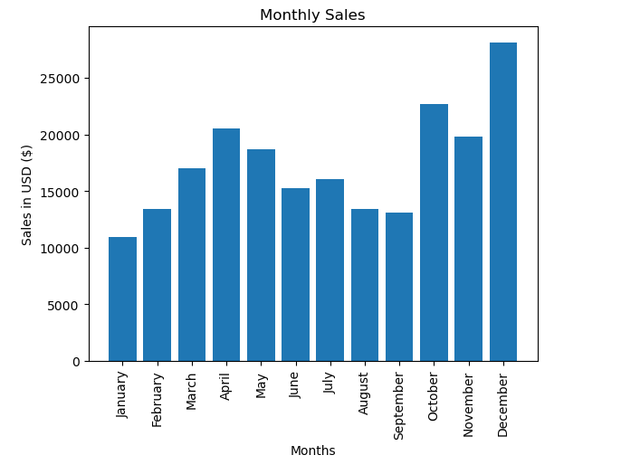
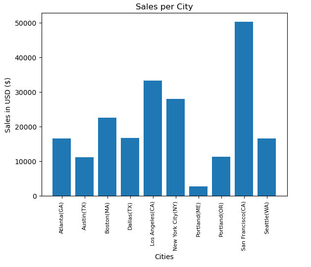
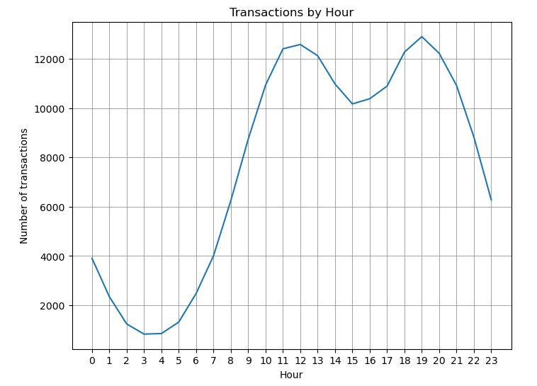

# Electronics Store Sales Analysis

## Table of Contents
- [Introduction](#introduction)
- [Research Questions](#research-questions)
- [Dataset](#dataset)
- [Technologies Used](#technologies-used)
- [Data Cleaning and Manipulation](#data-cleaning-and-manipulation)
- [Key Questions and Visualizations](#key-questions-and-visualizations)
  - [Question 1: Best Month for Sales](#question-1-best-month-for-sales)
  - [Question 2: City with the Most Product Sales](#question-2-city-with-the-most-product-sales)
  - [Question 3: Optimal Advertisement Timing](#question-3-optimal-advertisement-timing)
  - [Question 4: Frequently Bought Together Products](#question-4-frequently-bought-together-products)
  - [Question 5: Best-Selling Product](#question-5-best-selling-product)
- [Data Visualization](#data-visualization)
- [Team Contributions](#team-contributions)
- [How to Use](#how-to-use)
- [Conclusion](#conclusion)

---

## Introduction
Sales are one of the most critical aspects of any business for generating revenue, building customer relationships, and gaining market insights. Through data analysis, businesses can optimize their strategies, identify areas for growth, and make informed, data-driven decisions. 

This project analyzes an electronics store sales dataset using Python libraries, primarily **Pandas**, **Matplotlib**, and **Seaborn**. The primary goals are to clean and preprocess the data, explore sales trends, and answer key business questions through visualization and analysis.

---

## Research Questions
1. What was the best month for sales?
2. Which city sold the most products?
3. What time should advertisements be displayed to maximize the likelihood of purchases?
4. What products are often sold together?
5. Which product sold the most, and why?

---

## Dataset
The dataset, **"Electronics Store Sales Dataset for EDA"**, is sourced from [Kaggle](https://www.kaggle.com/), containing 12 CSV files (one for each month of 2019). Each file includes:
- **Order ID**: Unique identifier for each purchase.
- **Product**: Name of the product.
- **Quantity Ordered**: Quantity of the product ordered.
- **Price Each**: Price of the product.
- **Order Date**: Date and time of the order.
- **Purchase Address**: Address where the order was made.

---

## Technologies Used
- **Python**: Primary programming language.
- **Pandas**: Data cleaning, manipulation, and aggregation.
- **Matplotlib**: Data visualization.
- **Seaborn**: Advanced visualization.
- **OS Library**: File handling.

---

## Data Cleaning and Manipulation
The data cleaning and preparation process involved:
1. **Merging Monthly Data**: Combined all 12 CSV files into a single dataset using Python's `os` and `pandas` libraries.
2. **Handling Missing Values**: Removed rows with null values.
3. **Parsing and Cleaning Columns**:
   - Converted columns like `Order Date`, `Quantity Ordered`, and `Price Each` to the appropriate data types.
   - Extracted month and city information for easier analysis.
4. **Feature Engineering**:
   - Added new columns such as `Month`, `City`, `Sales` (calculated as `Quantity Ordered * Price Each`), and `Hour`.
5. **Filtering Invalid Rows**: Removed rows with invalid data (e.g., headers in the middle of files).

---

## Key Questions and Visualizations

### Question 1: Best Month for Sales
- **Insight**: Identified the month with the highest sales.
- **Visualization**: Bar chart showing monthly sales trends.




---

### Question 2: City with the Most Product Sales
- **Insight**: Determined which cities generated the highest revenue.
- **Visualization**: Bar chart illustrating sales by city.




---

### Question 3: Optimal Advertisement Timing
- **Insight**: Analyzed the time of day with the highest sales activity to determine the best times to display advertisements.
- **Visualization**: Line graph comparing hourly transactions and sales trends.



---

### Question 4: Frequently Bought Together Products
- **Insight**: Identified product pairs that are commonly purchased together.
- **Visualization**: List of product pairs and their purchase frequency.

---

### Question 5: Best-Selling Product
- **Insight**: Found the most frequently sold product and hypothesized why it performed so well.
- **Visualization**: Bar chart comparing sales of different products.

---

## Data Visualization
Data visualization played a crucial role in identifying patterns not apparent from raw data. Key techniques:
- **Bar Charts**: For sales by month, city, and product.
- **Line Graphs**: To analyze hourly sales trends.
- **Boxplots**: To visualize the distribution of sales by hour.

---

---

## How to Use
1. Clone the repository:
   ```bash
   git clone https://github.com/yourusername/electronics-store-sales-analysis.git
